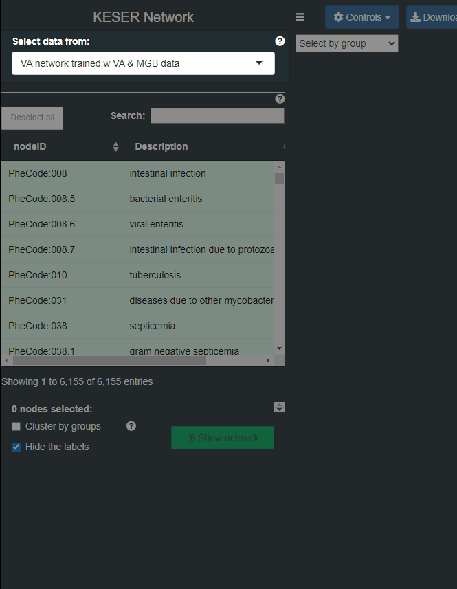
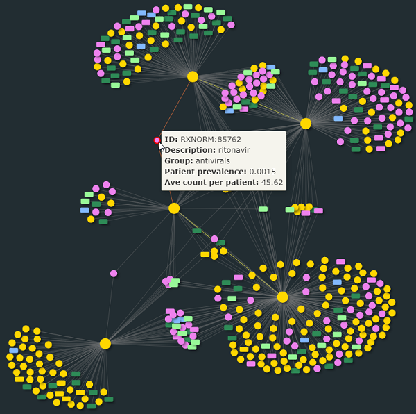
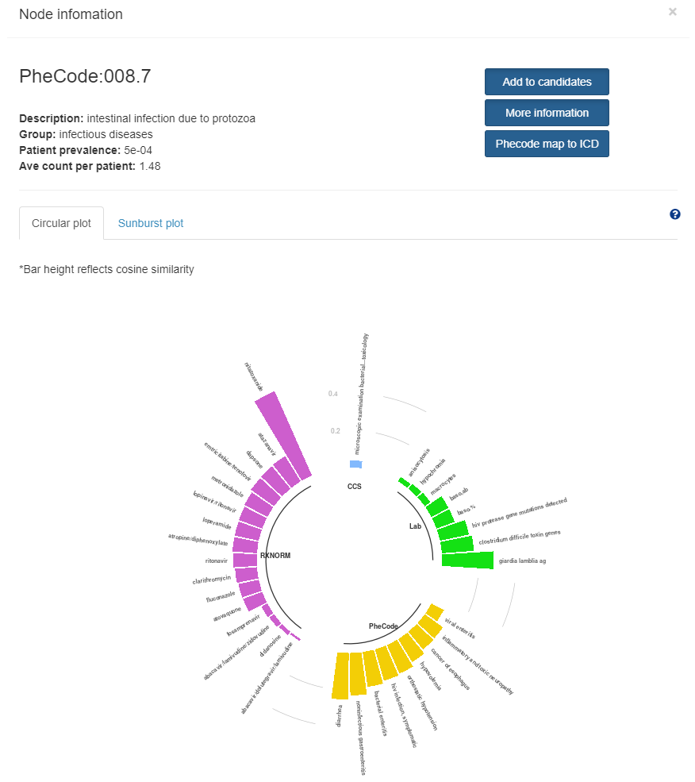

### Input center nodes

First of all, click a row in the input table. You can also enter some items in the filtering bar for each column (phenotype, ICD description etc.) to spot on your targets. Once a row are selected, the app will automatically display the hierarchy with the selected phecode as root node in the sunburst and tree plot.

- Step 1: Select a data set of Knowledge network construction method.
- Step 2: Select some target nodes (green rows) as candidate nodes to display the network. Multiple inputs are acceptable. You can also use the search bar on the top to spot on your targets. A second round of searching will not mask the previous selection, which will be kept unless you de-select the row or use the “Unselect” button on the navigation bar. 
- Step 3: Screening selected rows for candidate nodes.
- Step 4: Settings: 1) Cluster nodes by groups. 2) Show/Hide the labels in the network.
- Step 5: Confirm submission.

### Explore network information

Main panel

In general, the selected nodes will be the center nodes of the network. Nodes were rendered into 4 colors  and 2 shapes(ellipse nodes are targets nodes). By hovering mouse onto any node, basic information (id, name, group, etc.) will be showed. Click the node will popup a page with more information.

Popup page

1. Top left: basic information of the clicked node.
2. Top right: 
  - Add to candidates: add the clicked node to the candidate nodes.
  - More information: link to website of Phecode/RxNorm/Lab/CSS.
  - Phecode map to ICD: link to website of phecodemap app.
3. Bottom:
  - Circular plot: the cosine similarity of the connected nodes with the clicked node.
  - Sunburst plot: the hierarchy of the connected nodes with the clicked node.
  - Drug information: only for RxNorm nodes.
  - Lab information: only for Lab nodes.

